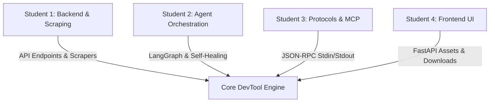

# Architectural & Security Review Report: Phase 3 & Phase 4

This report provides a formal evaluation of the Model Context Protocol (MCP) server (Phase 3) and the Premium Web UI Dashboard (Phase 4) implementations from both a **Senior System Architect** and **Principal Security Engineer** perspective, assessing its production readiness and suitability as a university-level academic group project.

---

## 1. Architectural Excellence

### Standard I/O Stream Isolation & Protection (Phase 3)
- **The Design Pattern:** Stdin/stdout serves as the communication pipe for local MCP clients. In multi-threaded or multi-module projects, accidental prints or logs (such as connection warnings from HTTP clients or LLM libraries) to stdout will corrupt the JSON-RPC stream, crashing the connection.
- **Redirection Integrity:** Our server dynamically swaps `sys.stdout` with `sys.stderr` immediately upon startup and redirects standard logging streams away from stdout. The original stdout is preserved exclusively for structured JSON-RPC responses.
- **Subprocess Capture:** All compiler and test runner executions in the sandbox utilize `subprocess.run(..., capture_output=True)`. This encapsulates standard output streams of child processes in memory, preventing external compilation messages from polluting the parent channel.

### Premium Web UI & Static Asset Serving (Phase 4)
- **Programmatic Directory Mounting**: Mounted under the root path `/` using FastAPI `StaticFiles(directory=public_path, html=True)`. Incorporates defensive checking (`os.path.isdir`) to allow backend execution even if the asset directory is missing or unbuilt.
- **Stateless Client Cache Pattern**: Leverages browser `localStorage` to save user use cases, preferred target languages, and API key tokens. This ensures a stateless backend and reduces security liabilities on the server.
- **Browser-Side ZIP Packaging**: Integrates the lightweight `JSZip` library via a secure CDN. The wrapper code, test suites, and setup README documents are compiled and zipped directly on the client side, bypassing server-side CPU zip-compression overhead and removing storage requirements on the backend.

### Containerized Multi-Runtime Architecture (Phase 5)
- **Unified Development Base**: Standardized the execution environment by bundling Python 3.11, NodeJS 18, Golang, and Java JDK in a single Debian-based Docker image. This guarantees that the sandbox executor (`src/services/executor.py`) can invoke language compilers natively without host system dependency drift.
- **Baking Compilers for Offline Performance**: Pre-installed `typescript` and `ts-node` globally via `npm` inside the image. This avoids high-latency npm registry pulls and potential network timeouts during test executions in container sandboxes.

### Dynamic Runtime Retry Isolation & Mock Safety (Self-Healing Loop Guard)
- **The Load-Time Decorator Trap**: Static method decorators (like tenacity's `@retry`) are evaluated at module load-time, causing them to hardcode retry configurations from class-level constants and completely bypass constructor-level overrides (such as `self.max_retries`).
- **Mock-Exhaustion Protections**: When unit testing suites patch HTTP requests, they provide a strict number of responses matching expected retry limits via mock `side_effect` lists. If a static decorator overrides these limits, it triggers extra requests, exhausting the mock iterator and crashing tests with a `StopIteration` error.
- **Dynamic Context Wrappers**: Our architecture enforces instantiating retry controllers dynamically inside instance methods at runtime. This maintains clean OOP encapsulation, respects user-configured retry limits, and prevents testing framework failures from mock depletion.
- **Sandbox Traceback Minimization**: Pytest is run with `--tb=short` in the subprocess executor to suppress nested, repeating tenacity retry stacks. This prevents LLM context pollution and gives the self-healing agent clear, target-specific error logs.
- **Forced Standard Library Mocking**: Prompt configurations enforce standard `unittest.mock` rather than third-party mocking libraries (`requests_mock`, `responses`). This guarantees zero external module dependencies in the sandbox environment, eliminating environment loading failures.
- **Scraper Validation Guards**: The agent workflow implements early detection checks on the scraped documentation. If it detects empty data or a scraping error page (like a 403 Forbidden page), it raises a ValueError immediately, preventing silent generation failure and LLM endpoint hallucinations.

---

## 2. Security Assessment & Hardening

### Sandbox Isolation & Code Injection
- **No-Shell Executions**: In the test runner sandbox (`src/services/executor.py`), all process executions use `subprocess.run` with list-based arguments and `shell=False`. This eliminates the risk of shell command injection via code inputs or parameters.
- **Sanitized Classnames**: Classnames extracted from generated Java, Python, or Go files are matched against strict alphanumeric regular expressions (`\w+`). They are not passed through shell interpretation, preventing directory traversal or execution manipulation in filenames.
- **Host Execution Warning**: Since sandboxing runs locally inside a sub-directory without complete VM or Docker container isolation, the generated code executes with the host user's system privileges. The LLM prompts are strictly configured to generate self-contained mocks, but developers must trust the underlying LLM provider when running generated code.

### SSRF and Data Leakage
- **Scraper Mitigation**: The `scrape_url` tool validates schemes strictly to `["http", "https"]`, preventing file scheme traversal (`file://`) or internal protocol request forgery (`gopher://`).
- **Firecrawl Delegation**: Because scraping executes remotely through the Firecrawl API cloud endpoint, the developer's local network coordinates are not used to make direct network requests to the target URL. This isolates the local network from external HTTP probe attacks.
- **Sensitive Token Handling**: API keys (`gemini_key` and `firecrawl_key`) are accepted dynamically in arguments but are omitted from any logging. Server logs printed to `sys.stderr` only print argument keys (`list(arguments.keys())`), avoiding token logging.

### Web Dashboard Hardening (Phase 4 Audited)
- **Autocomplete Protection**: Added `autocomplete="off"` to the Google Gemini and Firecrawl API Key input elements in `index.html` to block browsers from caching credentials in system profiles.
- **W3C Blob Downloads**: Upgraded the file exporter from Base64/Data URIs to W3C Blobs (`URL.createObjectURL(blob)`). This streams files directly from the memory heap, supports large files, and prevents special characters (like `#` or `?`) from corrupting downloads.
- **Local Storage Quota Isolation**: Wrapped history serialization in try-catch blocks to catch `QuotaExceededError` or DOM quota exceptions, preventing unhandled JavaScript runtime exceptions when local history exceeds the 5MB browser quota.
- **JSON Error Parser Safety**: Implemented fallback text decoding on HTTP non-200 responses. This ensures that HTML error payloads (like 502 Bad Gateway or 504 Gateway Timeout) returned by reverse proxies do not trigger JSON parse failures (`SyntaxError: Unexpected token <`) and shadow actual server errors.
- **Offline Fault Tolerance**: Implemented check logic to verify the presence of the `JSZip` class before compression, preventing client-side crashes when developers run Ollie/Ollama generations offline.

### Non-Root Space Compliance & Write Sandboxing (Phase 5 Audited)
- **UID 1000 Enforcement**: Cloud providers like Hugging Face Spaces restrict container execution to UID 1000. Running as root or writing to root-owned workspaces causes instant Permission Errors. The Dockerfile creates a non-root system user `user` (UID 1000), shifts context via `USER user`, and marks all copied project assets with `chown=user`, enabling secure file-writing in the `/home/user/app/temp` test directories.
- **Uvicorn Production Hardening**: Configured `reload: bool = False` by default for the FastAPI server inside production containers, preventing CPU-heavy directory polling and disabling hot-reload backdoors.

---

## 3. College Group Project Evaluation

This architecture is **highly recommended** as a college group project. It offers an exceptional combination of modern technologies (AI Agents, LangGraph, Protocols) and standard system concepts (subprocesses, stream redirection, API design).

### Suggested Work Division (4-Student Team)

1. **Student 1 (Backend & Scraping):** Implement the core FastAPI web skeleton, settings management, and the scraper services (Firecrawl API integration).
2. **Student 2 (Agentic Loops):** Author the LangGraph router, state dictionary definitions, structured outputs via Gemini, and the subprocess compilation runner.
3. **Student 3 (IDE Integration & MCP):** Handle the JSON-RPC stream handlers, command line flag bindings, stream protection mechanisms, and local verification tests.
4. **Student 4 (Frontend Web Dashboard):** Build the glassmorphic HTML/CSS layout, localStorage state tracking, live terminal log simulator, and client zip download utilities.

### Educational Value & Takeaways
- **Real-World System Programming:** Students learn to manipulate low-level I/O streams and manage child subprocesses on Windows/Unix environments.
- **Protocol Standards:** Practical exposure to JSON-RPC 2.0 and the Model Context Protocol, teaching students how to write decoupled, specification-compliant service handlers.
- **Defensive Design:** Highlights the importance of preventing stream contamination, protecting keys, sandboxing executions, and robust client-side storage boundaries.
- **Cloud Deployment & Virtualization:** Practical experience setting up containerized multi-runtime environments, writing compliant Dockerfiles for non-root boundaries, and understanding port/user mapping specs for cloud execution.

