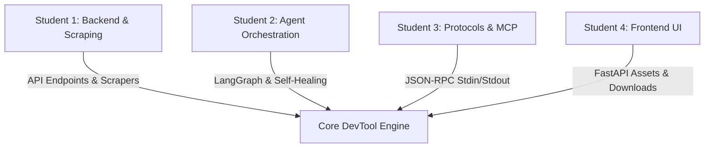

# Architectural & Security Review Report: Phase 3 (MCP Server Integration)

This report provides a formal evaluation of the Model Context Protocol (MCP) server implementation from both a **Senior System Architect** and **Principal Security Engineer** perspective, assessing its production readiness and suitability as an academic college group project.

---

## 1. Architectural Excellence

### Standard I/O Stream Isolation & Protection
- **The Design Pattern:** Stdin/stdout serves as the communication pipe for local MCP clients. In multi-threaded or multi-module projects, accidental prints or logs (such as connection warnings from HTTP clients or LLM libraries) to stdout will corrupt the JSON-RPC stream, crashing the connection.
- **Redirection Integrity:** Our server dynamically swaps `sys.stdout` with `sys.stderr` immediately upon startup and iterates through `logging.root.handlers` to redirect standard logging streams away from stdout. The original stdout is preserved exclusively for structured JSON-RPC responses.
- **Subprocess Capture:** All compiler and test runner executions in the sandbox utilize `subprocess.run(..., capture_output=True)`. This encapsulates standard output streams of child processes in memory, preventing external compilation messages from polluting the parent channel.

### JSON-RPC 2.0 Protocol Compliance
- **Handshake and Discovery:** Supported methods strictly implement `initialize`, `notifications/initialized`, `ping`, and `tools/list` lifecycles with correct schemas.
- **Specification-Compliant Notifications:** Implements checking for the presence of an `id` member. Notifications (which omit `id`) do not trigger responses back to stdout, complying with the JSON-RPC 2.0 specification.
- **Safe Parameter Decoding:** Parameters (`params` and `arguments`) are checked for type conformity. Non-dictionary parameters return appropriate protocol errors (`-32602` Invalid Params) or tool execution errors instead of throwing python exceptions.
- **UTF-8 and System Resilience:** System streams are reconfigured dynamically using `reconfigure(encoding="utf-8", errors="replace")` to handle Windows console encoding restrictions, ensuring standard unicode characters (such as output snippets or README markdown guides) do not raise encoding errors.

---

## 2. Security Assessment

### Subprocess Execution and Command Injection
- **No-Shell Executions:** In the test runner sandbox (`src/services/executor.py`), all process executions use `subprocess.run` with list-based arguments and `shell=False`. This eliminates the risk of shell command injection via code inputs or parameters.
- **Sanitized Classnames:** Classnames extracted from generated Java, Python, or Go files are matched against strict alphanumeric regular expressions (`\w+`). They are not passed through shell interpretation, preventing directory traversal or execution manipulation in filenames.
- **Host Execution Warning:** Since sandboxing runs locally inside a sub-directory without complete VM or Docker container isolation (out of scope for Phase 3), the generated code executes with the host user's system privileges. The LLM prompts are strictly configured to generate self-contained mocks, but developers using the tool must trust the underlying LLM provider when running generated code.

### SSRF and Data Leakage
- **Scraper Mitigation:** The `scrape_url` tool validates schemes strictly to `["http", "https"]`, preventing file scheme traversal (`file://`) or internal protocol request forgery (`gopher://`).
- **Firecrawl Delegation:** Because scraping executes remotely through the Firecrawl API cloud endpoint, the developer's local network coordinates are not used to make direct network requests to the target URL. This isolates the local network from external HTTP probe attacks.
- **Sensitive Token Handling:** API keys (`gemini_key` and `firecrawl_key`) are accepted dynamically in arguments but are omitted from any logging. Server logs printed to `sys.stderr` only print argument keys (`list(arguments.keys())`), avoiding token logging.

---

## 3. College Group Project Evaluation

This architecture is **highly recommended** as a college group project. It offers an exceptional combination of modern technologies (AI Agents, LangGraph, Protocols) and standard system concepts (subprocesses, stream redirection, API design).

### Suggested Work Division (4-Student Team)

1. **Student 1 (Backend & Scraping):** Implement the core FastAPI web skeleton, settings management, and the scraper services (Firecrawl API integration).
2. **Student 2 (Agentic Loops):** Author the LangGraph router, state dictionary definitions, structured outputs via Gemini, and the subprocess compilation runner.
3. **Student 3 (IDE Integration & MCP):** Handle the JSON-RPC stream handlers, command line flag bindings, stream protection mechanisms, and local verification tests.
4. **Student 4 (Frontend Web Dashboard):** Build the glassmorphic HTML/CSS layout, localStorage state tracking, live terminal log simulator, and client zip download utilities.

### Educational Value & Takeaways
- **Real-World System Programming:** Students learn to manipulate low-level standard I/O streams and manage child subprocesses on Windows/Unix environments.
- **Protocol Standards:** Practical exposure to JSON-RPC 2.0 and the Model Context Protocol, teaching students how to write decoupled, specification-compliant service handlers.
- **Defensive Design:** Highlights the importance of preventing stream contamination, protecting keys, and sandboxing executions.
