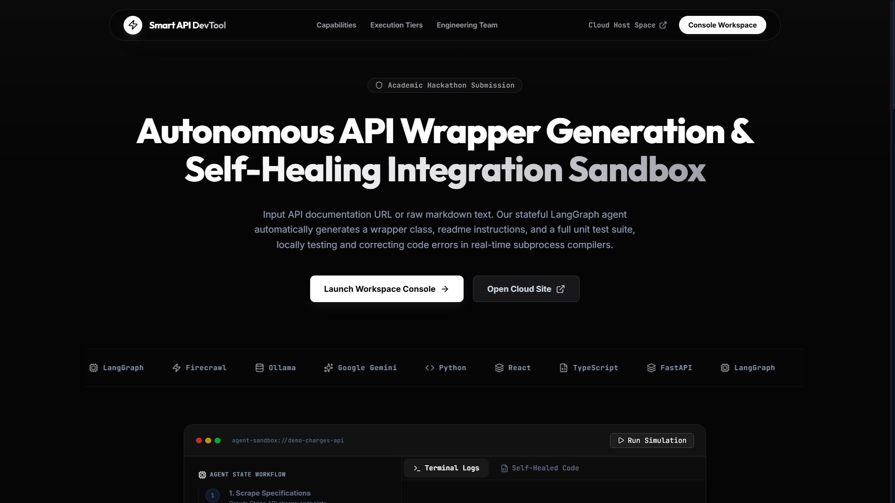
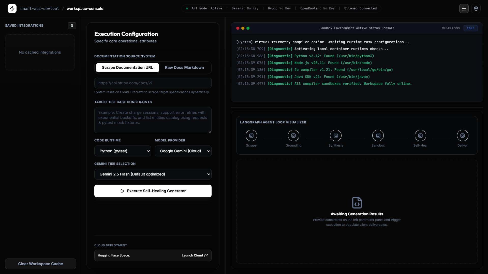
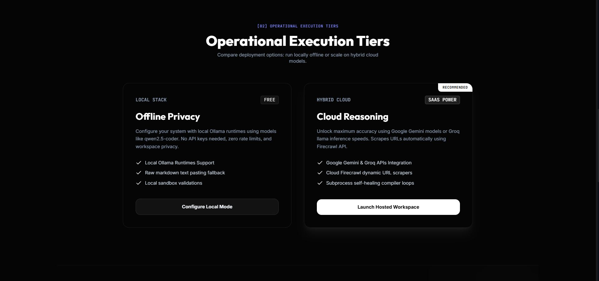

<div align="center">


# Smart API DevTool

**Autonomous API Wrapper Generation & Self-Healing Integration Sandbox**

Input an API documentation URL or paste raw markdown. The stateful LangGraph agent automatically generates a wrapper class, README instructions, and a full unit test suite — locally testing and correcting code errors in real-time subprocess compilers.

[](https://huggingface.co/spaces/Yash030/Smart-Dev-API-Tool)
[](https://python.org)
[](https://fastapi.tiangolo.com)
[](https://react.dev)
[](https://langchain-ai.github.io/langgraph/)

*Academic Hackathon Submission — Built as a full-stack agentic developer utility*

</div>


## What Is This?

Most developers waste hours reading API docs, hand-writing boilerplate wrapper code, and debugging network error handlers. This tool eliminates that pipeline entirely.

You give it **one input** — an API documentation URL or raw markdown text — along with a description of what you want to build. The agent handles the rest:

1. Scrapes the documentation using Firecrawl
2. Validates the content to confirm REST endpoints actually exist (fails fast on landing pages or marketing text)
3. Generates a production-ready, type-safe client wrapper class
4. Generates a companion unit test suite using only standard library mocking
5. Compiles and runs the tests locally in an isolated sandbox
6. If tests fail, reads the compiler output and autonomously fixes the code — up to 3 self-healing iterations

The result is downloadable client code, tests, and a README you can drop directly into your codebase.

## Screenshots

### Landing Page



The landing page demonstrates the LangGraph agent loop in a live interactive simulator. Watch the agent scrape, validate, synthesize, compile, self-heal, and deliver — all before running a single real generation.

---

### Workspace Console



The workspace console is where all the work happens. Configure your documentation source, define your use case constraints, choose a language and model provider, then execute the self-healing generator. Real-time terminal logs stream the agent's internal states as they pass through each LangGraph node.

---

### Execution Tiers



Two deployment models available. Compare them based on your privacy requirements and accuracy needs.


## Core Features

**Autonomous Code Generation**
The LangGraph state machine orchestrates a multi-node pipeline: scrape → validate → synthesize → test → self-heal → deliver. Each node writes to a shared state dictionary, making the entire workflow inspectable and debuggable.

**Pre-Generation Grounding Check**
Before spending any tokens on code generation, the agent validates that the scraped content actually contains REST endpoint routes. If it only finds marketing copy or high-level overviews, it fails immediately and tells you exactly why.

**Self-Healing Sandbox**
Generated code is written to an isolated UUID directory under `temp/`, and the appropriate compiler is invoked as a subprocess. If the exit code is non-zero, the full stderr + stdout stream is fed back to the model with a targeted repair prompt. This loops up to 3 times before delivering the final result.

**Multi-Language Support**
Supports Python (pytest), JavaScript (Node), TypeScript (ts-node), Go (go test), and Java (javac/java). All runtimes are pre-installed in the Docker image.

**Two Operation Modes**
- **Web Dashboard** — A React + FastAPI interface with a drag-resizable workspace console, sidebar history, and per-run terminal log output
- **MCP Server** — Run with `--mcp` to expose `scrape_url` and `generate_wrapper` tools directly to IDE agents like Claude Desktop or Cursor

**Stateless Browser History**
The backend stores nothing. All integration history, credentials (session-scoped), and past generated files live in the browser's `localStorage` and `sessionStorage`. No database, no user accounts.

**ZIP Export**
Download the generated client, tests, and README as a single `.zip` from the workspace console using JSZip — no server-side file storage required.

## Execution Tiers

Two modes available depending on your setup and privacy requirements.

| | Local Stack — Offline Privacy | Hybrid Cloud — Cloud Reasoning |
|---|---|---|
| **Cost** | Free | API key required |
| **Model** | Ollama `qwen2.5-coder` | Google Gemini 2.5 Flash or Groq Llama |
| **Scraping** | Raw markdown paste fallback | Firecrawl cloud URL scraping |
| **Accuracy** | Good for most APIs | Maximum (recommended) |
| **Rate Limits** | None | Provider-dependent |

> [!TIP]
> No Firecrawl API key? The scraper automatically operates in **Keyless Mode** — no sign-up needed, 1,000 free scrapes per month. For zero cost and full offline privacy, select **Ollama** in the model provider dropdown with `qwen2.5-coder` running on `localhost:11434`.

## Tech Stack

| Layer | Technology |
|---|---|
| Backend | Python 3.12, FastAPI, Uvicorn |
| Agent Orchestration | LangGraph StateGraph |
| AI Providers | Google Gemini (`google-genai` SDK), Groq, OpenRouter, Ollama |
| Frontend | React 19, TypeScript, Tailwind CSS v4, Framer Motion |
| Scraper | Firecrawl REST API (keyless + keyed modes) |
| Sandbox Compilers | Python (pytest), Node.js, ts-node, Go, Java (javac) |
| Deployment | Docker (multi-runtime), Hugging Face Spaces |
| State Management | Browser `localStorage` + `sessionStorage` (stateless backend) |


## How the Self-Healing Loop Works

```
[Docs Scraping] ──► [Grounding Pre-Check] ──► [Generator Node] ──► [Sandbox Test Node]
                            │                         ▲                      │
                            ▼ (No REST specs)         │  (Fails, retry < 3)  │
                       [Fail Fast UI]                 └──────────────────────┴──► [Deliver]
```

**1. State Initialization**
The agent state is a typed dictionary that carries the scraped text, use case description, target language, model provider, retry count, and diagnostic logs across all graph nodes.

**2. Pre-Check Grounding Validation**
The model inspects the first ~15,000 characters of the scraped content and returns a structured boolean — `has_rest_apis`. If false, the entire pipeline short-circuits with a descriptive error message, no code generation credit spent.

**3. Predict (Generator Node)**
The model is prompted with the full docs, use case constraints, and a set of strict language-specific rules covering mocking patterns, import conventions, and retry logic design. It returns structured JSON matching the Pydantic output schema: `overview`, `endpoints`, `code`, `tests`, `readme`.

**4. Act & Verify (Executor Node)**
The executor writes generated files to `temp/run_{uuid}/`, invokes the language-native test runner as a subprocess, enforces a strict timeout (15s for most languages, 30s for Go/Java), and captures exit code and streams.

**5. Self-Heal (Loop)**
Non-zero exit code? The full compiler output (stdout + stderr) is appended to the agent state as `error_logs`, retry count increments, and the graph loops back to the generator with a targeted repair prompt. On success or after 3 attempts, the graph delivers the final state.

The workspace console includes a live node visualizer that illuminates each step as the agent passes through it:

```
[ Scrape ] → [ Grounding ] → [ Synthesize ] → [ Sandbox ] → [ Self-Heal ] → [ Deliver ]
```


## Local Setup

### Prerequisites

- Python 3.12+
- Node.js 18+ (for JavaScript/TypeScript sandbox execution)
- Go 1.21+ (optional, for Go sandbox)
- JDK 21+ (optional, for Java sandbox)
- Ollama (optional, for local offline mode)

> [!IMPORTANT]
> If a runtime is missing (e.g., no Go installed), the executor catches the exception cleanly and returns diagnostic output without crashing the core agent thread. You only need the runtimes for the languages you intend to generate.

### 1. Clone and Set Up Python Environment

```bash
git clone https://github.com/Yashwant00CR7/Smart-API-Integration-Dev-Tool
cd "Smart-API-Integration-Dev-Tool"

python -m venv venv
venv\Scripts\activate        # Windows
source venv/bin/activate     # macOS / Linux

pip install -r requirements.txt
```

### 2. Configure Environment Variables

Copy the example file and fill in your keys:

```bash
cp .env.example .env
```

```ini
GEMINI_API_KEY=your_gemini_api_key_here
GROQ_API_KEY=your_groq_api_key_here
OPENROUTER_API_KEY=your_openrouter_api_key_here
FIRECRAWL_API_KEY=optional_leave_blank_for_keyless_mode
OLLAMA_BASE_URL=http://localhost:11434
HOST=0.0.0.0
PORT=7860
```

> [!NOTE]
> Keys set here apply globally to all sessions. Users can also supply per-session keys through the workspace settings drawer — those are stored only in `sessionStorage` and cleared when the tab closes.

### 3. Build the Frontend (Optional)

The `public/` directory already contains a pre-built production bundle. To develop the React frontend locally:

```bash
cd frontend
npm install
npm run build        # outputs to ../public/
```

### 4. Start the Server

```bash
python main.py
```

Open `http://localhost:7860` in your browser.

### Running as an MCP Server

```bash
python main.py --mcp
```

This starts the JSON-RPC 2.0 server over stdin/stdout. Two tools are exposed:

| Tool | Description |
|---|---|
| `scrape_url` | Scrapes a documentation URL via Firecrawl and returns clean markdown |
| `generate_wrapper` | Runs the full self-healing agent loop and returns generated files |


## API Reference

### `GET /api/health`

Returns server status and which API keys are configured.

```json
{
  "status": "healthy",
  "configuration": {
    "has_gemini_key": true,
    "has_groq_key": false,
    "has_firecrawl_key": true,
    "ollama_base_url": "http://localhost:11434"
  }
}
```

### `POST /api/analyze`

Runs the full agent pipeline and returns generated artifacts.

```json
{
  "url": "https://api.stripe.com/docs/api/charges",
  "use_case": "Create charge sessions, support error retries with exponential backoff, and list the charge catalog.",
  "language": "python",
  "model_provider": "gemini",
  "gemini_model": "gemini-2.5-flash"
}
```

Response includes `overview`, `endpoints`, `code`, `tests`, `readme`, `retry_count`, `test_passed`, and `error_logs`.


## Docker Deployment

The Dockerfile bundles all language runtimes into a single image and runs as a non-root user (`uid=1000`) to comply with Hugging Face Spaces security requirements.

```bash
docker build -t smart-api-devtool .
docker run -p 7860:7860 \
  -e GEMINI_API_KEY=your_key \
  -e FIRECRAWL_API_KEY=your_key \
  smart-api-devtool
```

The image includes: Python 3.11, Node.js 18, Go, OpenJDK, TypeScript, and ts-node.

> [!NOTE]
> TypeScript and ts-node are installed globally as root before switching to the `user` account. This ensures `npx ts-node` sandbox executions have write access to the global cache without permission errors on Hugging Face's restricted filesystem.


## Project Structure

```
├── main.py                    # Entrypoint — FastAPI server or MCP server (--mcp flag)
├── requirements.txt           # Python dependencies
├── Dockerfile                 # Multi-runtime container image
├── .env.example               # Environment variable template
├── src/
│   ├── app.py                 # FastAPI routes, CORS config, static file serving
│   ├── config.py              # Pydantic Settings — loads and validates env vars
│   ├── agent.py               # LangGraph StateGraph, generation nodes, self-healing loop
│   ├── mcp_server.py          # JSON-RPC 2.0 MCP server over stdin/stdout
│   └── services/
│       ├── scraper.py         # Firecrawl client with SSL validation and rate limit retries
│       └── executor.py        # Sandbox subprocess runner with UUID isolation and timeouts
├── frontend/                  # React + TypeScript + Tailwind source
│   └── src/
│       ├── App.tsx            # Full workspace console and landing page SPA
│       └── main.tsx
├── public/                    # Pre-built frontend bundle (served by FastAPI StaticFiles)
├── docs/                      # Screenshots used in this README
├── learning-records/          # Technical design logs for each phase of development
└── lessons/                   # Academic curriculum HTML files covering architecture decisions
```

## Known Behaviors & Notes

> [!NOTE]
> The backend is fully stateless. Integration history, API keys entered in the UI, and generated code are stored exclusively in the browser — nothing is persisted server-side. Clearing browser storage removes all cached records.

> [!WARNING]
> Ollama local mode uses `qwen2.5-coder` with a `num_predict` cap of 4096 tokens. Very large API documentation inputs may produce truncated JSON. For long docs, use Gemini or Groq instead, or trim the documentation to the relevant endpoints section before pasting.

> [!TIP]
> When using the Groq provider with reasoning models (Qwen or DeepSeek variants), the agent automatically appends a concise thinking instruction to reduce chain-of-thought verbosity and avoid hitting output token limits.

> [!IMPORTANT]
> Retry logic in generated Python wrappers uses `tenacity.Retrying` as a **dynamic context wrapper**, not a static class decorator. Static decorators evaluate configuration at load time and ignore instance-level overrides like `self.max_retries`, which exhausts mock `side_effect` iterators and triggers `StopIteration` errors. The dynamic pattern resolves this.

## Supported Languages & Runtimes

| Language | Test Framework | Sandbox Command | Notes |
|---|---|---|---|
| Python | pytest | `pytest test_client.py` | `unittest.mock` only — no `requests_mock` |
| JavaScript | Node assert | `node test_client.test.js` | CommonJS only, global `fetch`, no axios |
| TypeScript | ts-node assert | `ts-node --transpile-only test_client.test.ts` | Named exports, global `fetch`, no Jest/Mocha |
| Go | testing package | `go test -v client.go client_test.go` | `httptest.NewServer` for mocking, no httpmock |
| Java | native assert | `javac *.java && java -ea TestClient` | No JUnit/Mockito, `-ea` flag enabled |

## Contributing

This project was built as a college hackathon submission. The `learning-records/` directory contains detailed technical write-ups for every architectural decision made during development — useful context before contributing.

## License

MIT
